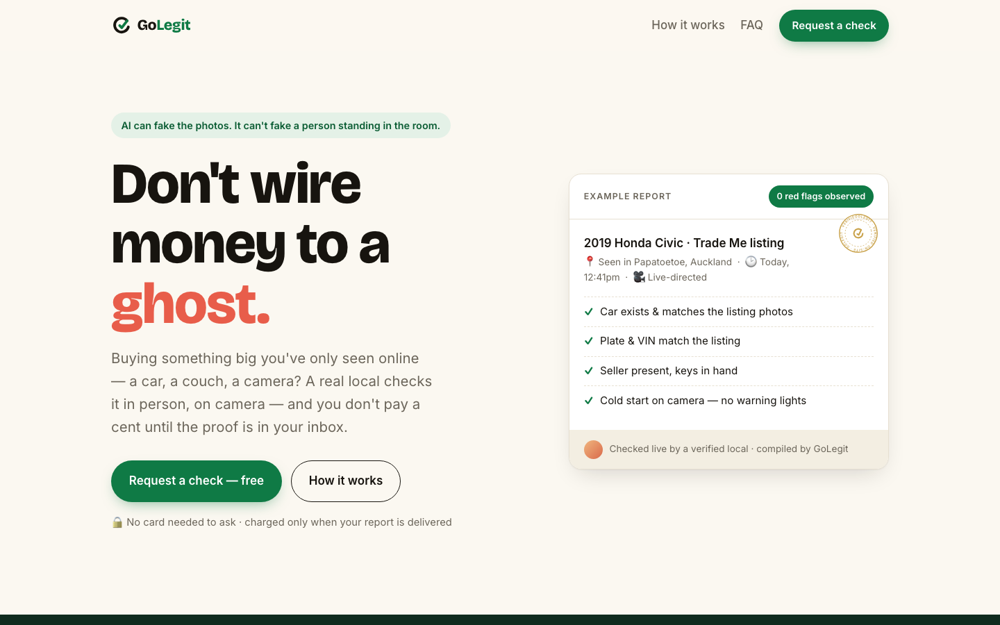
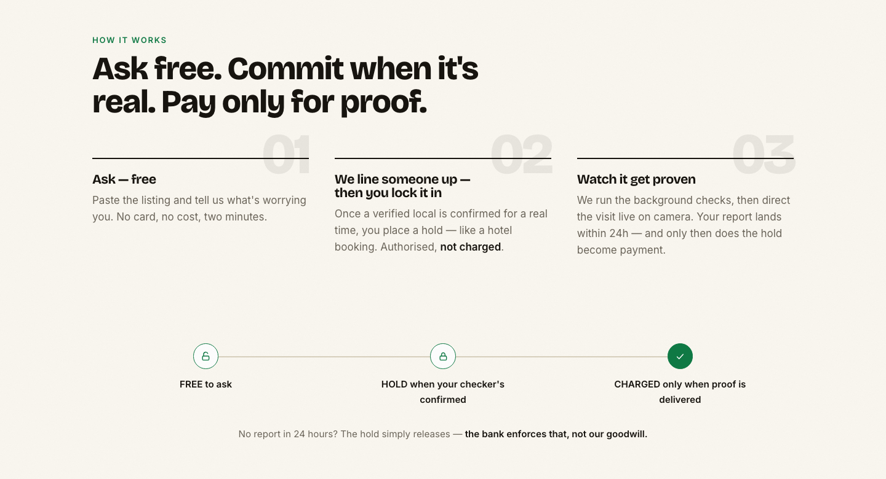
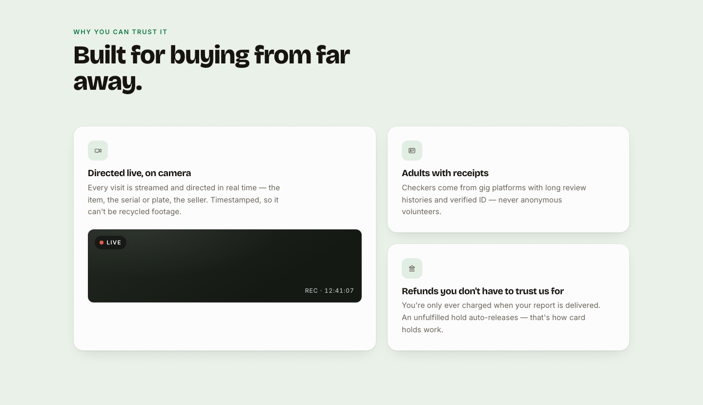
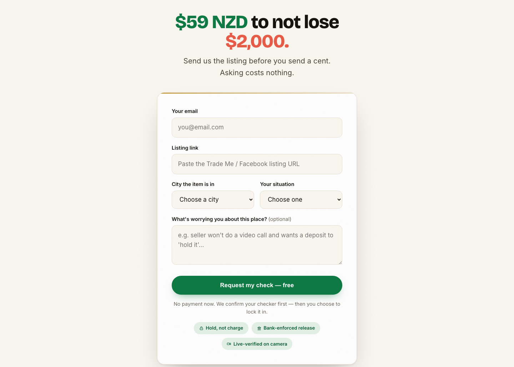
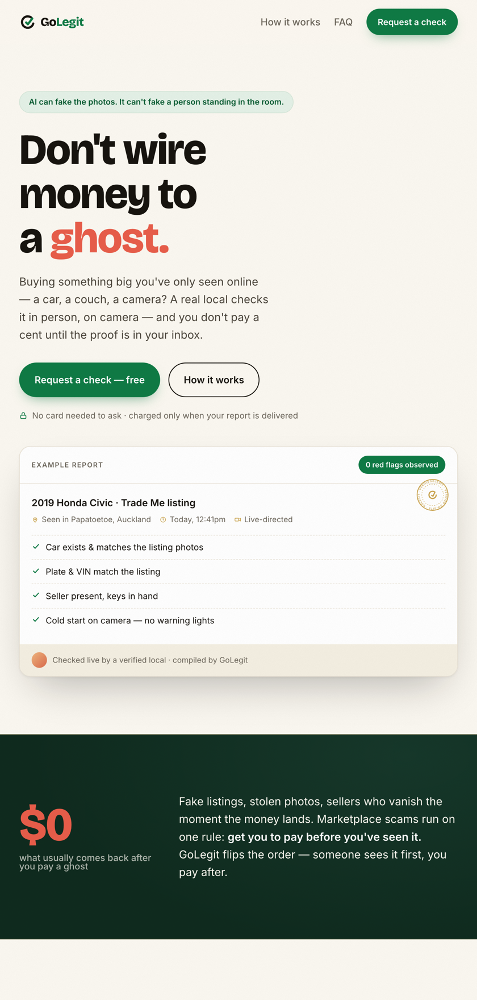

<p align="center">
  
</p>

<h1 align="center">GoLegit</h1>

<p align="center"><strong>Don't wire money to a ghost.</strong><br/>
A real local checks your marketplace purchase in person, on camera — and you don't pay a cent until the proof is in your inbox.</p>

---

## The problem

Buying something big you've only seen online — a car on Trade Me, a couch on Facebook Marketplace, a camera from a stranger two cities away — runs on one broken rule: **you pay before you've seen it.**

Fake listings, stolen photos, sellers who vanish the moment the money lands. And it's getting worse, not better: reverse image search used to catch recycled scam photos, but **AI-generated listing photos are unique files — no lookup can flag them.** The only thing left that can't be faked is a person physically standing in front of the item, live on camera.

GoLegit flips the order: **someone sees it first, you pay after.**

## What GoLegit does

You paste a listing. We line up a verified local near the item. They visit while you watch and direct the camera live — *show me the plate, the serial number, start the engine cold*. Within 24 hours you get a timestamped report of exactly what was observed, before any money goes to the seller.



## How it works



1. **Ask — free.** Paste the listing and tell us what's worrying you. No card, no cost, two minutes.
2. **We line someone up — then you lock it in.** Once a verified local is confirmed for a real time, you place a card hold — like a hotel booking. Authorised, not charged.
3. **Watch it get proven.** Background checks run first, then you direct the visit live on camera. Your report lands within 24h — and only then does the hold become payment.

### When money moves

| Moment | Your card |
|---|---|
| 🔓 You submit the form | Untouched. Asking is free. |
| 🔒 Your checker is confirmed | A hold is placed — authorised, **not charged** |
| ✓ Report delivered within 24h | The hold is captured and becomes the payment |
| ✗ No report in 24h | The hold auto-releases — **enforced by the card network, not our goodwill** |

There is no moment where you've paid and are hoping for the best. That's the entire point of the product, so it's also how the product charges.

## What a check includes

**Layer 1 — desk forensics.** Before anyone travels: listing history, image provenance, and public-record checks on the item (e.g. plate and registration for vehicles).

**Layer 2 — the live-directed visit.** A checker goes to the item and streams the visit in real time. The buyer directs the camera; the checker's own eyes are on the item, the serial or plate, and the seller. Live and timestamped, so it can't be recycled or generated footage.



Checkers are adults sourced per-job from established gig platforms with long review histories and verified ID — never anonymous volunteers. They never handle the buyer's money and never know the purchase price; they're paid to observe and film.

## Pricing

| Tier | Price (NZD) | For |
|---|---|---|
| Standard | $39 | Small items, quick visits |
| Plus | $59 | Cars, furniture, most checks |
| Full | $79 | High-value or multi-stop checks |

Against an average marketplace-scam loss of **$2,000+**, a $59 check prices like insurance that actually does something before the loss.



## Why now

- **AI killed photo trust.** When any listing photo can be generated in seconds, remote verification tools stop working. Physical presence becomes the moat — it's the one layer of the stack AI can't fake.
- **The mechanics are proven.** WeGoLook (2010) proved on-demand dispatch of gig "lookers" works operationally — then drifted into B2B insurance inspections and was acquired by Crawford & Co (2017). The consumer wedge was never re-run under today's conditions: normalized gig work, ubiquitous live video, and an actual epidemic of listing fraud. Same pattern as Webvan → Instacart: right idea, re-run when the environment catches up.
- **Marketplaces won't build this.** Trade Me and Facebook profit from friction-free listings; verification is a cost center and an admission of the problem. That leaves the trust layer to a third party with no stake in the sale.

## Status

**Validation phase — deliberately no product beyond this page.**

This repo is a zero-dependency landing page for a concierge test: real requests come in through the form, and every check is fulfilled manually (desk research by hand, checkers booked per-job, reports written from a template, holds via payment links). Software only gets built where repetition proves it's needed.

- [x] Landing page — positioning, money rail, trust design, request form
- [x] Custom logo + brand (paper/ink/vault-green palette, notary-seal motif)
- [x] Form hardening — submit states, inline errors, endpoint-ready
- [ ] Wire form endpoint (Formspree)
- [ ] Deploy (Vercel) + domain
- [ ] Launch-city coverage + first community posts
- [ ] **The test: 2 weeks, pass bar = 5+ cold strangers placing card holds**

If the bar isn't met, the idea dies cheaply — total spend to find out is under NZ$100.

## Stack

Plain HTML, CSS, and JavaScript. No framework, no build step, no dependencies.

A validation page has one job: load instantly, look trustworthy, capture requests. Everything configurable lives at the top of `app.js` — covered cities, form endpoint, and a price ladder driven by a URL parameter (`?p=39|59|79`) for testing price sensitivity per marketing channel.

```bash
# run locally
cd golegit
python3 -m http.server 3000
# → http://localhost:3000
```

<p align="center">
  
</p>

## The fine print

GoLegit reports what our checker verifies and observes on-site at a point in time — real eyes on the ground, real evidence from a real person. It is **not a legal guarantee**, and anyone selling you one is lying. The report exists so your own judgement has something real to work with before money moves.
